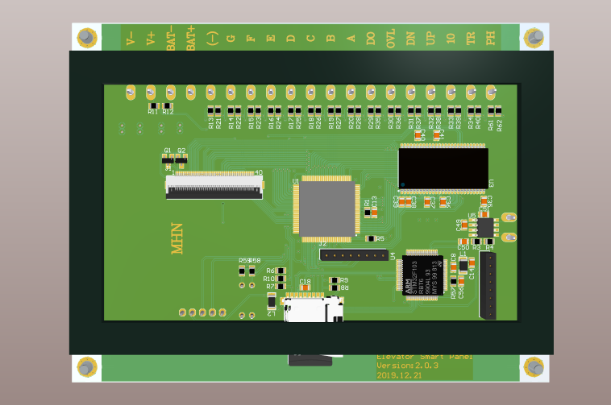
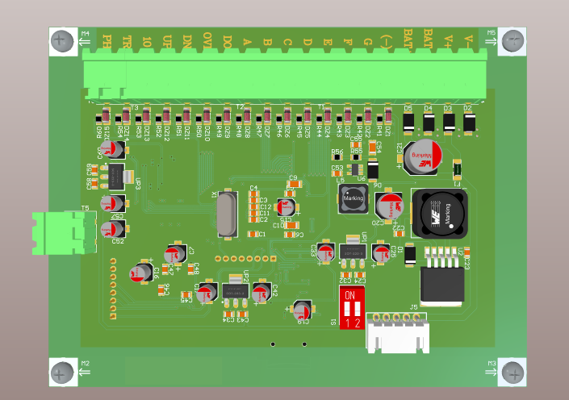
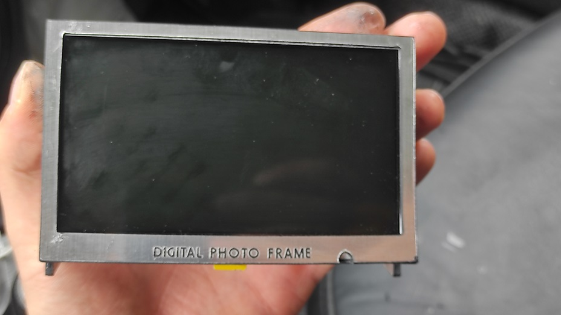
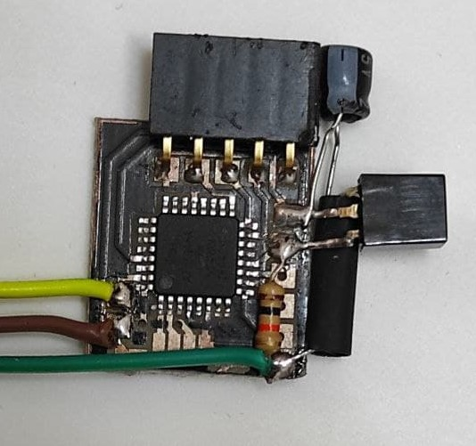
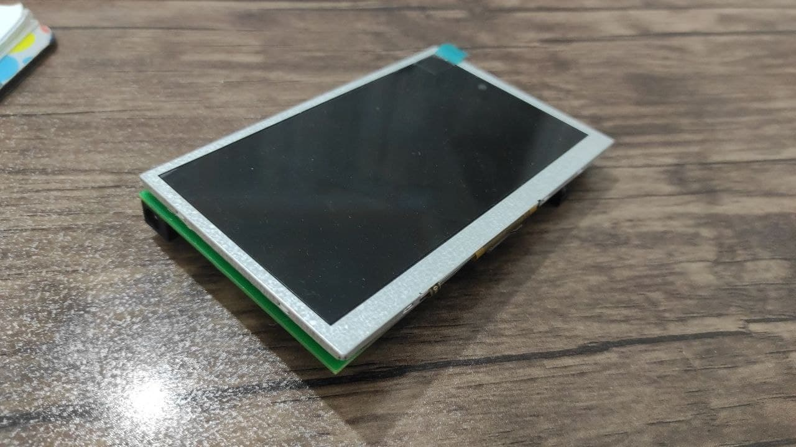
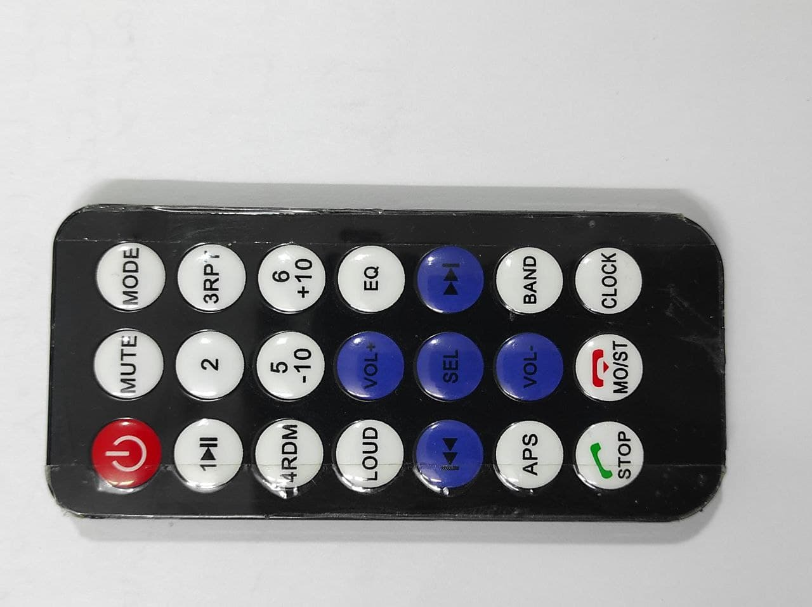
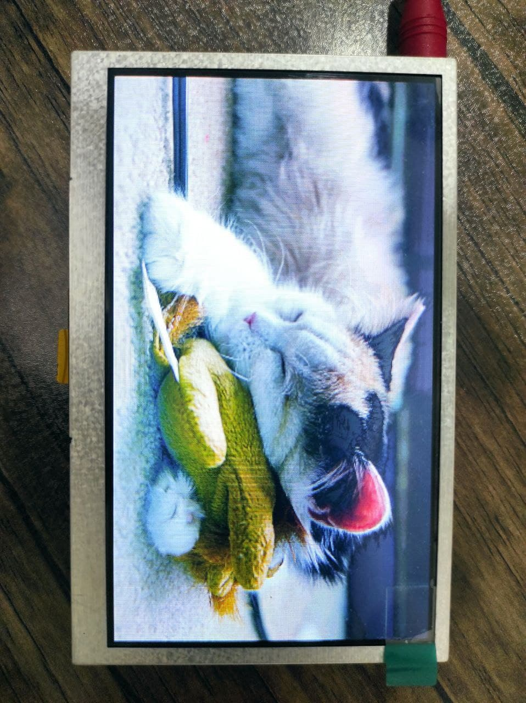
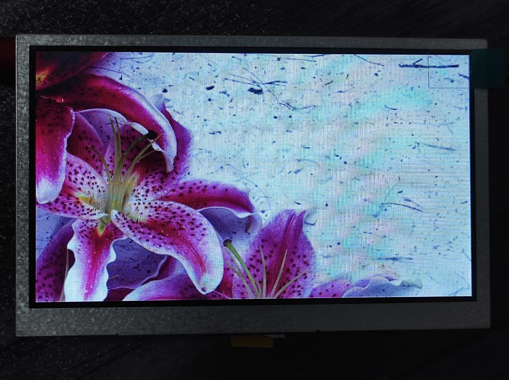
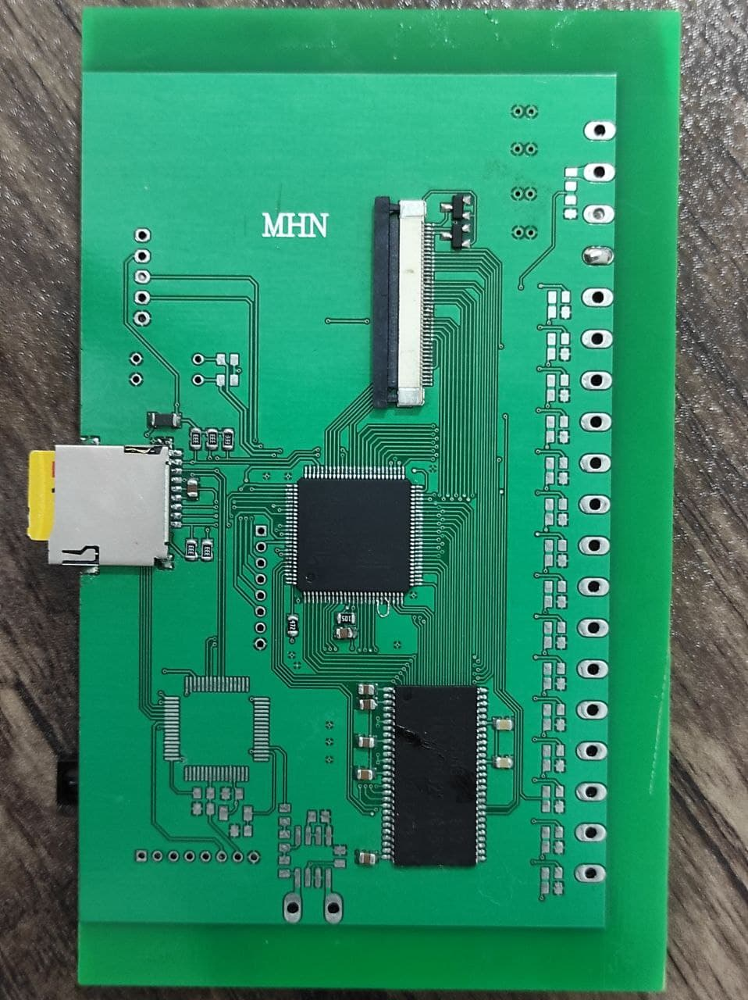
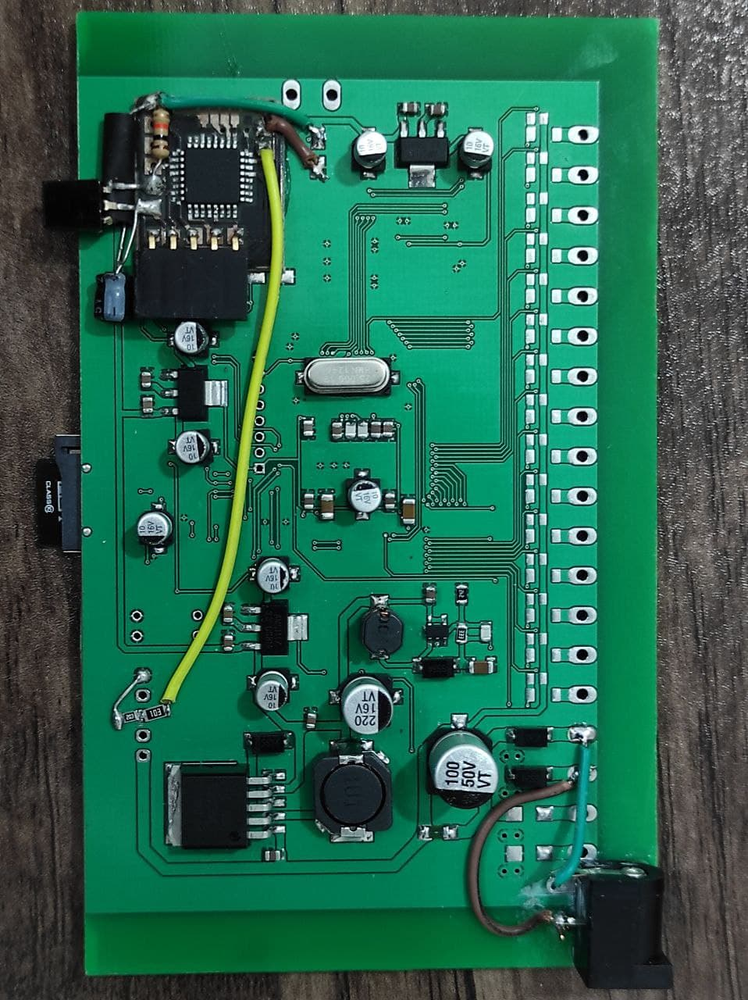

# Digital Photo Frame

This project is a custom-built digital photo frame capable of displaying images stored on an SD card. It features an STM32F4-based main controller, a secondary IR receiver module, a custom PCB, and a Windows companion application for image conversion.

## Project Structure

The repository is organized into the following key directories:

- **MCU Codes/**
  - **Main Program/**: STM32F407 firmware (STM32CubeIDE project) that handles SD card reading (FatFs), SRAM management, and LCD driving.
  - **IR Receiver/**: Code for a secondary microcontroller (likely AVR based on `.cproj` files) to handle Infrared Remote signals.

- **Image Converter Application/**
  - A C# Windows Forms application (`App1.sln`) used to convert and resize standard images (BMP, JPG, PNG) into the specific raw RGB format required by the photo frame.

- **PCB/**
  - **Ver 2.02/**: Altium Designer project files (`.PcbDoc`, `.SchDoc`) for the custom hardware board, featuring the STM32F407VET6, SD card slot, and LCD interface.

- **Mechanical Design/**
  - Includes CorelDRAW files (`Photo Frame.cdr`) for the physical frame or enclosure design.

## Features

- **Storage**: Reads images from an SD card formatted with FAT file system.
- **Display**: Drives an LCD panel (custom driver implemented in `main.c`).
- **Control**: Supports remote control inputs via the IR receiver module.
- **Format Support**: Uses a custom RGB raw format generated by the companion app (e.g., `1.rgb`, `2.rgb`).
- **Memory**: Utilizes external SRAM for image buffering.

## Usage

1. **Image Preparation**:
   - Use the **Image Converter Application** to format your photos.
   - Save the converted files to the root of an SD card (files should be named sequentially like `1.rgb`).

2. **Electronics**:
   - Assemble the PCB based on the designs in `PCB/Ver 2.02/`.
   - Program the Main MCU with the firmware in `MCU Codes/Main Program/`.
   - Program the IR Receiver MCU with the firmware in `MCU Codes/IR Receiver/`.

3. **Operation**:
   - Insert the SD card.
   - Power on the device.
   - Use the remote to navigate through the slideshow (`LCD_Show`, `Slide_Show` functions).

## Gallery

### Hardware & PCB

### Operation Demo

